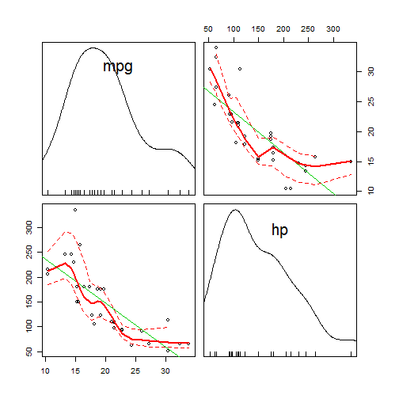

Developing Data Products - Peer Graded Assignment
========================================================
author: Harm Lammers
date: 12-04-2017
autosize: true

Introduction
========================================================

This presentation is part of Coursera's MOOC on Data Science by JHU

It's goal is to ensure a student understands and masters the concepts of 
- building a R shiny application and 
- presenting this with R Presentation.

The source code can be found on Github: 'http://github/harmlammers'.


Application
========================================================

The application is a small modification of the prediction model used in class.  
I used the mtcars database to predict the MilesPerGallon on a given Horsepower value.

The application shows the results of two prediction models in a graph.  
The user manipulates HP as the input and the application predicts the values of MPG given the two models derived from the mtcars - database.  
  
The user can remove or incl{ude the prediction lines of the two models presented.  
https://harmlammers.shinyapps.io/DDP04PGMa/


Data
========================================================
  
The model is based on R's dataset mtcars.  
  
Documentation: https://stat.ethz.ch/R-manual/R-devel/library/datasets/html/mtcars.html  
  
This model only uses the MilesPerGallon and the Horsepower values.  
  

```r
data <- mtcars[,c(1,4)] 
summary(data)
```

```
      mpg              hp       
 Min.   :10.40   Min.   : 52.0  
 1st Qu.:15.43   1st Qu.: 96.5  
 Median :19.20   Median :123.0  
 Mean   :20.09   Mean   :146.7  
 3rd Qu.:22.80   3rd Qu.:180.0  
 Max.   :33.90   Max.   :335.0  
```

Visual on the data
========================================================
  

